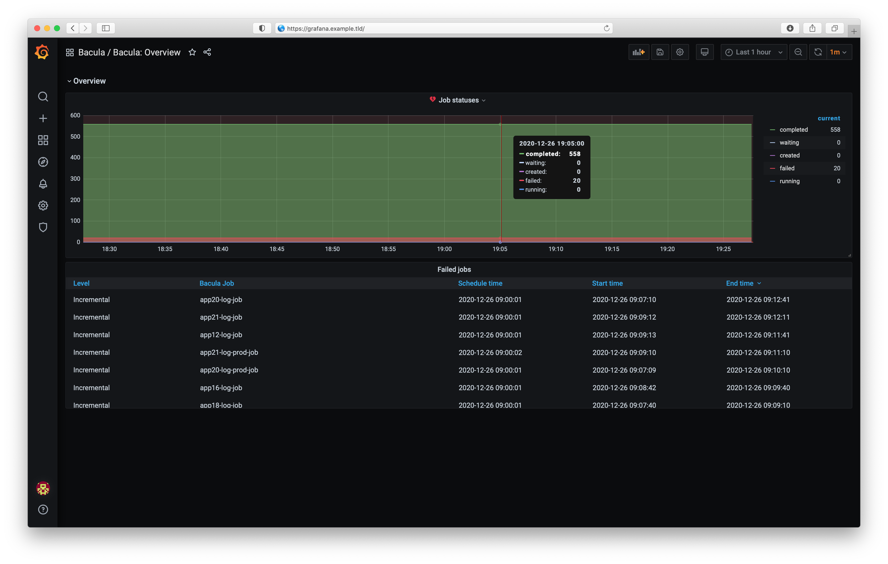

# About

Prometheus Exporter for [Bacula](https://bacula.org/) metrics written in Go.

## Overview

### Demo

<p align="center"><a href="#readme"></a></p>

### Requirements

Note, that the following dependencies should be satisfied.

- [Docker](https://docker.com)
- [Docker Compose](https://docs.docker.com/compose/)
- [Golang](https://golang.org/) v1.13 or higher

### Supported backends

Currently we are supporting only PostgreSQL backend.

## Features

Prometheus Expoter exposes several metrics.

### Latest jobs

**Metrics details**

| Name                             | Exposed informations                                                  |
| -------------------------------- | --------------------------------------------------------------------- |
| `bacula_latest_job_files_total`  | Total files saved for server during latest backup for client combined |
| `bacula_latest_job_bytes_total`  | Total bytes saved for server during latest backup for client combined |
| `bacula_latest_job_sched_time`   | Timestamp when the latest job was scheduled                           |
| `bacula_latest_job_start_time`   | Timestamp when the latest job was started                             |
| `bacula_latest_job_end_time`     | Timestamp when the latest job was ended                               |

**Metrics output example**

```txt
# TYPE bacula_latest_job_bytes_total gauge
bacula_latest_job_bytes_total{level="F",name="app1-job",status="T"} 2.585135999e+09
bacula_latest_job_bytes_total{level="I",name="app1-job",status="T"} 265559
# TYPE bacula_latest_job_end_time counter
bacula_latest_job_end_time{level="F",name="app1-job",status="T"} 1.60540267e+09
bacula_latest_job_end_time{level="I",name="app1-job",status="T"} 1.605661203e+09
# TYPE bacula_latest_job_files_total gauge
bacula_latest_job_files_total{level="F",name="app1-job",status="T"} 5135
bacula_latest_job_files_total{level="I",name="app1-job",status="T"} 34
# TYPE bacula_latest_job_sched_time counter
bacula_latest_job_sched_time{level="F",name="app1-job",status="T"} 1.605790438e+09
bacula_latest_job_sched_time{level="I",name="app1-job",status="T"} 1.605790438e+09
# TYPE bacula_latest_job_start_time counter
bacula_latest_job_start_time{level="F",name="app1-job",status="T"} 1.605402002e+09
bacula_latest_job_start_time{level="I",name="app1-job",status="T"} 1.605661201e+09
```

### Jobs summary

**Metrics details**

| Name                             | Exposed informations                                                  |
| -------------------------------- | --------------------------------------------------------------------- |
| `bacula_summary_job_files_total` | Total files saved for server during all backups for client combined   |
| `bacula_summary_job_bytes_total` | Total bytes saved for server during all backups for client combined   |

**Metrics output details**

```txt
# TYPE bacula_summary_job_bytes_total gauge
bacula_summary_job_bytes_total{level="F",name="app1-job"} 5.472818095e+09
bacula_summary_job_bytes_total{level="I",name="app1-job"} 8.4448111e+07
# TYPE bacula_summary_job_files_total gauge
bacula_summary_job_files_total{level="F",name="app1-job"} 10140
bacula_summary_job_files_total{level="I",name="app1-job"} 348
```

## Build

### From the source code

```shell
make deps
make all
```

### Docker image

```shell
make docker
```

## Deploy

### Binary

```
bacula_exporter -c /path/to/bacula_exporter.knf
```

### Docker image

```shell
docker pull funbox/bacula_exporter:1.0.1
```

## Usage

### Command line

```txt
Usage: bacula_exporter {options}

Options

  --config, -c file    Path to configuraion file
  --no-color, -nc      Disable colors in output
  --help, -h           Show this help message
  --version, -v        Show version
```

### Configuration

```txt
[http]

  # HTTP server IP
  ip: 0.0.0.0

  # HTTP server port
  port: 33407

  # HTTP metrics endpoint
  endpoint: /metrics

[db]

  # Database name
  name: bacula

  # Username
  username: bacula

  # Password
  password: keepinsecret

  # IP address or FQDN
  host: db.example.tld

  # Port
  port: 5432

  # SSL mode
  sslmode: disable

[log]

  # Log output (file/console)
  output: console

  # Log file dir
  dir: /

  # Path to log file
  file: {log:dir}/bacula_exporter.log

  # Log permissions
  perms: 600

  # Default log level (debug/info/warn/error/crit)
  level: info
```

## Development

### Run environment

Run development environment.

```shell
docker-compose up -d
```

Open Grafana (http://127.0.0.1:3000).

### Build status

| Artifact | Status |
|------------|--------|
| `docker` | [](https://github.com/funbox/bacula_exporter) |

## Contribute

If you like Bacula Exporter, please give me a star. This will help more people know Bacula Exporter.

Please feel free to send me [pull requests](https://github.com/funbox/bacula_exporter/pulls).

## License

MIT
